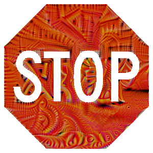

# ShapeShifter: Robust Physical Adversarial Attack on Faster R-CNN Object Detector

## Overview

This is the code repository for the ECML-PKDD 2018 paper: **ShapeShifter: Robust Physical Adversarial Attack on Faster R-CNN Object Detector**

The arXiv version is available at https://arxiv.org/abs/1804.05810

The code included here reproduces our techniques presented in the paper.

In this work, we tackle the more challenging problem of crafting physical adversarial perturbations to fool image-based object detectors like Faster R-CNN.
Attacking an object detector is more difficult than attacking an image classifier, as it needs to mislead the classification results in multiple bounding boxes with different scales.
Our approach can generate perturbed stop signs that are consistently mis-detected by Faster R-CNN as other objects, posing a potential threat to autonomous vehicles and other safety-critical computer vision systems.


## Install Dependencies

This repository depends on Tensorflow Object Detection API.
Follow the installation instructions at https://github.com/tensorflow/models/blob/master/research/object_detection/g3doc/installation.md

## How to Run the Code

Run the ipython notebook by the command
```bash
jupyter notebook robust_physical_attack.ipynb
```

You can also run the code directly using this Colaboratory link. No need to download or install anything!

https://colab.research.google.com/drive/1Vu9HqbIKqXWlr0IH1z3oCq3K3dHE1t4H

---
:new:

Alternatively, you can use our `shapeshifter2d.py` and `shapeshifter3d.py` scripts to generate shapeshifter-style perturbations. We currently only have an example for generating a targeted and untargeted 2D stop sign perturbation in the `Makefile`:
```
make 2d_targeted_attack
make 2d_untargeted_attack
make 2d_rpn_attack
```

You will have to first install our dependencies and patches via:
```
make deps
```
This will create a Python 3.6 virtual environment, install dependencies via [Pipenv](https://pipenv.kennethreitz.org/en/latest/) (we assume Pipenv is already installed), compile protobufs in the [Object Detection API](https://github.com/tensorflow/models/tree/master/research/object_detection), and apply our patches to the [Object Detection API](https://github.com/tensorflow/models/tree/master/research/object_detection) and [Lucid](https://github.com/tensorflow/lucid) dependencies.

You can watch the progress of the perturbation generation via:
```
make tensorboard
```
Navigate your browser to the printed url to see the Tensorboard output.

You can also see example outputs from these scripts in the pictures section below.

:soon:

We also plan to release our 3D ShapeShifter pedestrian models that we showcased in our [recent talk at DSML'19](https://arxiv.org/abs/1904.12622).

## Pictures of Targeted and Untargeted Attacks
### Targeted (Person) Perturbation
We used `make 2d_targeted_attack` to create this perturbation.


### Untargeted Perturbation
We used `make 2d_untargeted_attack` to create this perturbation.


### RPN Attack
We used `make 2d_rpn_attack` to create this perturbation.



## Videos of Targeted and Untargeted Attacks

### High-confidence Person Perturbation:
https://youtu.be/pc2ssNY98LA

[](https://youtu.be/pc2ssNY98LA)

Transferability Experiments: https://youtu.be/O3w00VI4hl0

### High-confidence Sports Ball Perturbation:
https://youtu.be/qHFjYWDUW3U

[](https://youtu.be/qHFjYWDUW3U)

Transferability Experiments: https://youtu.be/yqTVVfnsjxI

### High-confidence Untargeted Attack:
https://youtu.be/906DxYYj_JE

[](https://youtu.be/906DxYYj_JE)

Transferability Experiments: https://youtu.be/4KFhULX3v58


Snapshots of the drive-by test results. In (a), the person perturbation was detected 38% of the frames as a person and only once as a stop sign. The perturbation in (b) was detected 11% of the time as a sports ball and never as a stop sign. The untargeted perturbation in (c) was never detected as a stop sign or anything else.


## Researchers

|  Name                 | Affiliation                     |
|-----------------------|---------------------------------|
| Shang-Tse Chen        | Georgia Institute of Technology |
| Cory Cornelius        | Intel Corporation               |
| Jason Martin          | Intel Corporation               |
| Polo Chau             | Georgia Institute of Technology |
